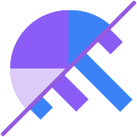

<p align="center">
  
</p>

# Statsio API

Backend de **Statsio**, plateforme de data journalism permettant à des créateurs de transformer des données en dashboards, articles et sondages interactifs.

API REST construite avec **Laravel 12**, organisée en **Domain-Driven Design (DDD)**.

> Projet frontend associé : [`statsio-front`](../statsio-front) (Nuxt 4) — consomme cette API. Voir son [README](../statsio-front/README.md).

## Sommaire

- [Stack technique](#stack-technique)
- [Prérequis](#prérequis)
- [Cloner le projet](#cloner-le-projet)
- [Démarrage rapide avec Docker (recommandé)](#démarrage-rapide-avec-docker-recommandé)
- [Installation manuelle (sans Docker)](#installation-manuelle-sans-docker)
- [Variables d'environnement](#variables-denvironnement)
- [Architecture](#architecture)
- [Commandes utiles](#commandes-utiles)
- [Tests](#tests)
- [Déploiement](#déploiement)

## Stack technique

| Composant | Choix |
|---|---|
| Langage / Framework | PHP 8.3 · Laravel 12 |
| Base de données | PostgreSQL 16 (18 en prod) |
| Cache / Queue | Redis 7 (driver `database` pour les queues) |
| Authentification | Laravel Sanctum + Google OAuth |
| Stockage fichiers | Local (dev) · Cloudflare R2 (prod, via `league/flysystem-aws-s3-v3`) |
| Traitement de données | DuckDB CLI (pipeline Parquet) · PhpSpreadsheet (CSV/XLSX) |
| Emails | SMTP Brevo (prod) · MailHog (dev, capture locale) |
| Observabilité | OpenObserve + Vector (agrégation des logs des conteneurs) |
| Tests | PHPUnit |
| Reverse proxy (prod) | Nginx + Traefik (TLS, routing par domaine) |

## Prérequis

### Avec Docker (recommandé)

- [Docker](https://docs.docker.com/get-docker/) et Docker Compose v2 (`docker compose`)

C'est tout : PHP, les extensions, DuckDB, PostgreSQL et Redis sont fournis par les conteneurs.

### Sans Docker (installation locale)

- PHP **8.3+** avec les extensions : `pdo_pgsql`, `pgsql`, `mbstring`, `exif`, `pcntl`, `bcmath`, `gd`, `zip`, `redis`
- [Composer](https://getcomposer.org/) 2
- PostgreSQL 16+
- Redis 7+
- [DuckDB CLI](https://duckdb.org/docs/installation/) (utilisé par le pipeline d'ingestion de données)
- Node.js 20+ (uniquement pour les assets legacy `resources/` compilés par Vite, non utilisés par le produit — le frontend réel est dans `statsio-front/`)

## Cloner le projet

```bash
git clone git@github.com:Statsio/statsio-api.git
cd statsio-api
```

## Démarrage rapide avec Docker (recommandé)

```bash
cp .env.example .env
docker compose up -d --build
```

Le service `api` installe automatiquement les dépendances Composer, génère la clé d'application, joue les migrations et démarre le serveur ainsi qu'un worker de queue (`queue=ingestion`) au premier lancement.

Accès une fois les conteneurs prêts :

| Service | URL |
|---|---|
| API | http://localhost:8080 |
| Base de données PostgreSQL | `localhost:5432` (`statsio` / `statsio`) |
| Redis | `localhost:6379` |
| MailHog (capture des emails envoyés en dev) | http://localhost:8025 |
| OpenObserve (logs centralisés) | http://localhost:5080 |

Commandes courantes :

```bash
docker compose logs -f api          # logs en temps réel
docker compose exec api php artisan tinker
docker compose exec api php artisan migrate
docker compose exec api bash
docker compose down                 # arrêter
docker compose down -v              # arrêter + supprimer les volumes (⚠️ efface la BDD)
```

> Un `docker-compose.prod.yml` distinct décrit la stack de production (Nginx + Traefik + OpenObserve/Vector) — voir [Déploiement](#déploiement).

## Installation manuelle (sans Docker)

```bash
composer install
cp .env.example .env
php artisan key:generate

# Configurer .env : DB_HOST=127.0.0.1, REDIS_HOST=127.0.0.1, etc.
# (les valeurs par défaut ciblent les noms de service Docker "db" / "redis")

php artisan migrate

composer dev
```

`composer dev` lance en parallèle le serveur Laravel, un worker de queue (`queue:listen --queue=ingestion`), les logs (`pail`) et Vite — pratique pour développer sans Docker.

## Variables d'environnement

Toutes les variables sont documentées dans [`.env.example`](.env.example). Points clés :

| Groupe | Variables | Notes |
|---|---|---|
| Application | `APP_ENV`, `APP_DEBUG`, `APP_URL`, `FRONTEND_URL` | `FRONTEND_URL` doit pointer vers `statsio-front` |
| Base de données | `DB_CONNECTION=pgsql`, `DB_HOST`, `DB_PORT`, `DB_DATABASE`, `DB_USERNAME`, `DB_PASSWORD` | |
| Auth | `SANCTUM_EXPIRATION` (15 min), `AUTH_REFRESH_TOKEN_TTL_DAYS` (30j), `GOOGLE_CLIENT_ID` | |
| CORS / Sanctum | `SANCTUM_STATEFUL_DOMAINS`, `CORS_ALLOWED_ORIGINS` | doivent inclure l'origine du frontend |
| Cache / Queue / Redis | `CACHE_STORE=redis`, `QUEUE_CONNECTION=database`, `REDIS_HOST`, `REDIS_PORT` | |
| Stockage | `DATASETS_DISK`, `MEDIA_DISK`, `R2_*` | `local`/`public` en dev, `r2-datasets`/`r2-media` en prod |
| Ingestion de données | `STATS_DATA_MAX_SNAPSHOT_ROWS`, `STATS_DATA_MAX_QUERY_ROWS`, `UPLOAD_MAX_FILESIZE`, `POST_MAX_SIZE` | voir [Architecture](#architecture) |
| Mail | `MAIL_MAILER`, `MAIL_HOST` (Brevo en prod), `BREVO_API_KEY` | en dev, laisser MailHog capter les emails |
| APIs externes | `MEDICAMENTS_API_BASE_URL`, `WHO_GHO_API_BASE_URL`, `ICD11_*`, `UMLS_*` | données publiques utilisées par MédiStats ; laisser vide pour dégrader proprement les intégrations optionnelles |
| Observabilité | `ZO_ROOT_USER_EMAIL`, `ZO_ROOT_USER_PASSWORD` | credentials OpenObserve |

⚠️ Ne jamais committer de vraies valeurs pour les secrets (`GOOGLE_CLIENT_ID`, `ICD11_CLIENT_SECRET`, `UMLS_API_KEY`, `BREVO_API_KEY`, `R2_*`) — uniquement dans `.env` local ou les secrets CI/CD.

## Architecture

Le code métier suit une architecture **Domain-Driven Design**, séparée de la couche framework :

```
app/
├── Domain/                  # Logique métier pure, organisée par domaine
│   ├── Auth/                #   Actions, DTOs, Exceptions
│   ├── Channel/              #   Chaînes éditoriales
│   ├── DataIngestion/        #   Pipeline d'ingestion de données
│   ├── HealthCheck/
│   ├── Media/
│   ├── Tv/                   #   TVStats
│   └── User/
├── Services/                 # Services applicatifs (orchestration, intégrations externes)
│   ├── DataIngestion/         #   Parsing, écriture Parquet, requêtes "live"
│   ├── Medicaments/ Maladies/ Pays/ Soins/ Who/   # MédiStats (APIs publiques santé)
│   └── LanguageService.php
├── Http/
│   ├── Controllers/           # Contrôleurs HTTP (fins, délèguent aux Actions/Services)
│   ├── Middleware/
│   └── Requests/               # Form Requests (validation)
└── Models/                    # Modèles Eloquent, organisés par domaine

routes/api/                    # Routes découpées par domaine (auth.php, channel.php, ...)
database/                      # Migrations, factories, seeders
tests/{Feature,Unit}/          # PHPUnit, miroir de la structure app/
```

**Convention de nommage** dans `app/Domain/*` : `{Nom}Action.php`, `{Nom}DTO.php`, `{Nom}Enum.php`, `{Description}Exception.php`.

### Domaines métier

| Domaine | Rôle |
|---|---|
| Auth | Connexion email/password, Google OAuth, tokens Sanctum (access + refresh) |
| User | Comptes utilisateurs, profils |
| Channel | Chaînes éditoriales |
| Media | Upload et gestion de médias |
| DataIngestion | Ingestion de sources de données (CSV/XLSX/JSON/API) → dashboards |
| Tv | Tableaux de bord TVStats |
| HealthCheck | Endpoint de supervision |

### Pipeline d'ingestion de données (DataIngestion)

Cœur technique de Statsio. Chaque source a un mode de **matérialisation** :

- **`snapshot`** (par défaut, fichiers CSV/XLSX/JSON et API en mode standard) : upload → job async → parsing, inférence de schéma, écriture d'un fichier **Parquet** → toute lecture ultérieure se fait sur ce Parquet, sans appel réseau.
- **`live`** (sources API uniquement) : aucune matérialisation ; chaque consultation déclenche un appel HTTP à l'API externe, avec cache court, rate-limit et plafond de lignes (`config/statsio.php` → `data_ingestion.live_query.*`).

Voir `App\Services\DataIngestion\Contracts\ParquetWriterInterface` (point d'extension pour la génération Parquet) et `App\Services\DataIngestion\LiveQuery\` pour le mode live.

## Commandes utiles

```bash
php artisan migrate            # jouer les migrations
php artisan tinker             # console interactive
./vendor/bin/pint               # formatage du code (PSR-12)
php artisan test                # tests (voir aussi composer test)
```

## Tests

```bash
composer test
# ou
php artisan test
```

Les tests sont organisés en `tests/Feature/` (par domaine) et `tests/Unit/`, avec une base de données de test séparée et des factories pour générer les données.

## Déploiement

La stack de production (`docker-compose.prod.yml`) ajoute par rapport au dev :

- `docker/php/Dockerfile.prod` : image PHP optimisée (sans dépendances dev)
- `queue` : worker de queue dédié, séparé du service `api`
- `nginx` : sert l'application PHP via FastCGI (`docker/nginx/nginx.fastcgi.conf`)
- `traefik` : reverse proxy avec TLS automatique et routing par domaine (`api.statsio.fr`, `observe.statsio.fr`, `traefik.statsio.fr`)
- `openobserve` + `vector` : centralisation des logs de tous les conteneurs

```bash
docker compose -f docker-compose.prod.yml up -d --build
```

Nécessite un fichier `.env.prod` (mêmes clés que `.env.example`, avec les valeurs de production) et un réseau Docker externe `edge` partagé avec les autres services exposés via Traefik.

Un `docker-compose.staging.yml` existe également pour l'environnement de recette.
